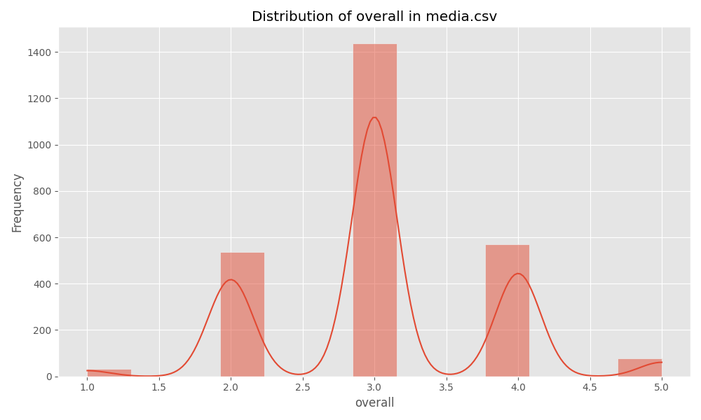
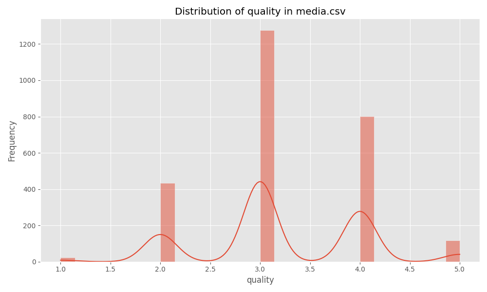
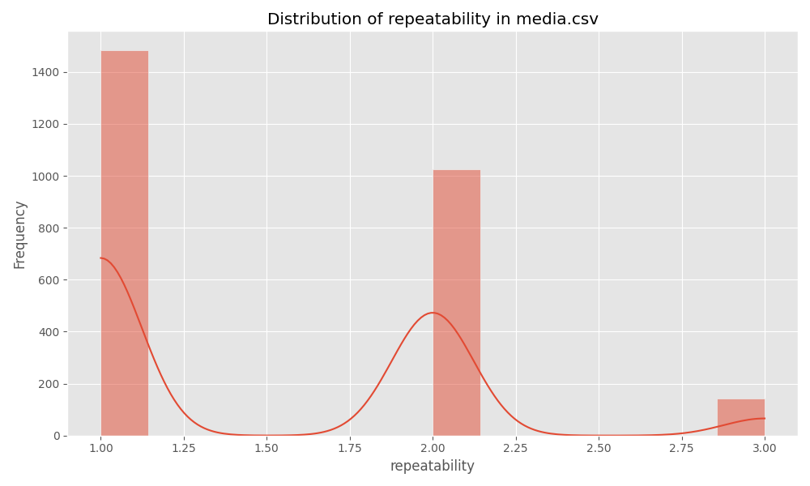
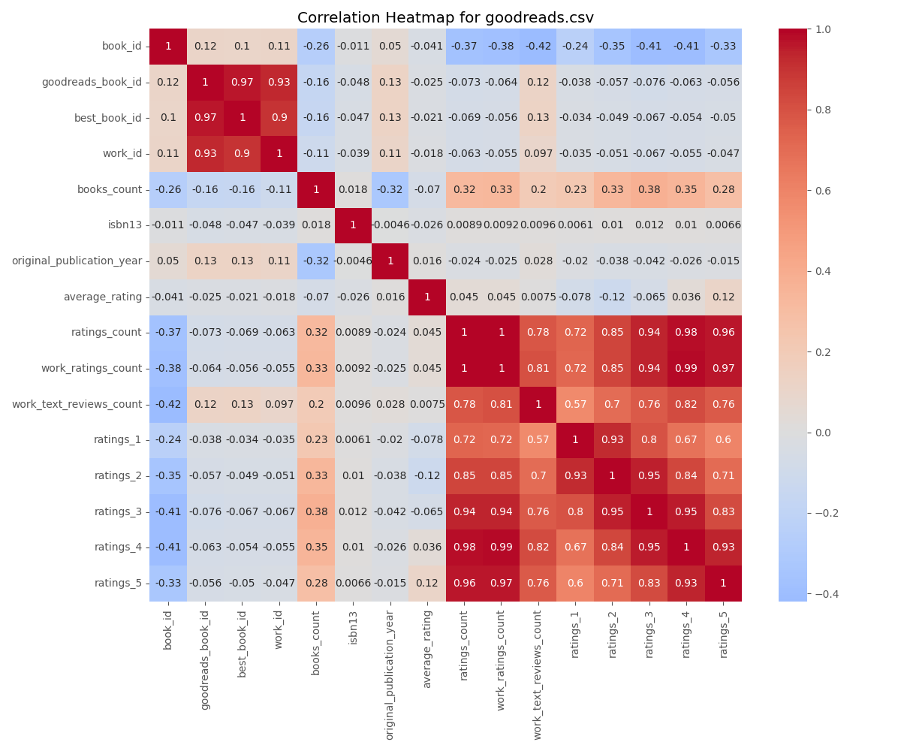

# Data Analysis Report for media.csv

## Narrative Analysis
There are 361 missing values across the dataset.

### Data Distribution Insights
- Column 'overall' has a mean of 3.0475113122171944 and a standard deviation of 0.7621797580962717.
- Column 'quality' has a mean of 3.2092760180995477 and a standard deviation of 0.7967426636666686.
- Column 'repeatability' has a mean of 1.4947209653092006 and a standard deviation of 0.598289430580212.

### Correlation Insights
- Strong correlation between 'overall' and 'overall': 1.00
- Strong correlation between 'overall' and 'quality': 0.83
- Strong correlation between 'overall' and 'repeatability': 0.51
- Strong correlation between 'quality' and 'overall': 0.83
- Strong correlation between 'quality' and 'quality': 1.00
- Strong correlation between 'repeatability' and 'overall': 0.51
- Strong correlation between 'repeatability' and 'repeatability': 1.00
## Descriptive Statistics
### overall
- count: 2652.0
- mean: 3.0475113122171944
- std: 0.7621797580962717
- min: 1.0
- 25%: 3.0
- 50%: 3.0
- 75%: 3.0
- max: 5.0
### quality
- count: 2652.0
- mean: 3.2092760180995477
- std: 0.7967426636666686
- min: 1.0
- 25%: 3.0
- 50%: 3.0
- 75%: 4.0
- max: 5.0
### repeatability
- count: 2652.0
- mean: 1.4947209653092006
- std: 0.598289430580212
- min: 1.0
- 25%: 1.0
- 50%: 1.0
- 75%: 2.0
- max: 3.0

## Missing Values
- date: 99
- language: 0
- type: 0
- title: 0
- by: 262
- overall: 0
- quality: 0
- repeatability: 0

## Correlation Matrix
```
overall: {'overall': 1.0, 'quality': 0.8259352331454309, 'repeatability': 0.5126000083900123}
quality: {'overall': 0.8259352331454309, 'quality': 1.0, 'repeatability': 0.31212651153886395}
repeatability: {'overall': 0.5126000083900123, 'quality': 0.31212651153886395, 'repeatability': 1.0}
```

## Visualizations




