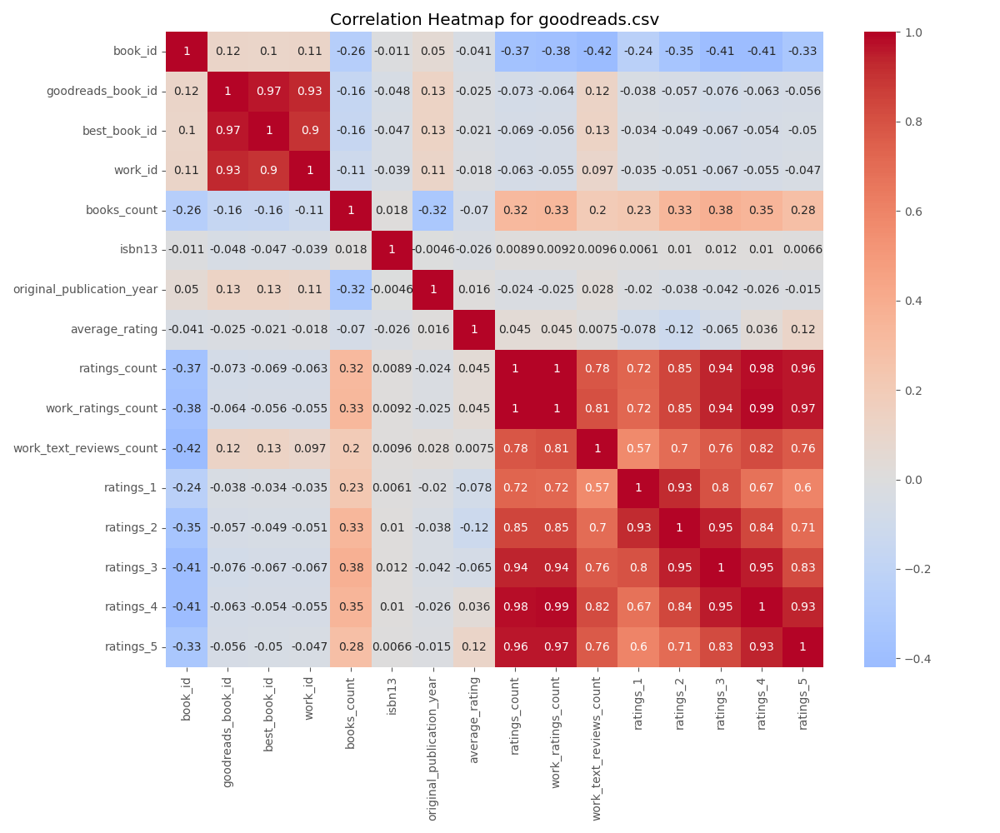

# Data Analysis Report for goodreads.csv

## Narrative Analysis
There are 2975 missing values across the dataset.

### Data Distribution Insights
- Column 'book_id' has a mean of 5000.5 and a standard deviation of 2886.8956799071675.
- Column 'goodreads_book_id' has a mean of 5264696.5132 and a standard deviation of 7575461.863589611.
- Column 'best_book_id' has a mean of 5471213.5801 and a standard deviation of 7827329.890719961.
- Column 'work_id' has a mean of 8646183.4246 and a standard deviation of 11751060.824080039.
- Column 'books_count' has a mean of 75.7127 and a standard deviation of 170.47072765025834.
- Column 'isbn13' has a mean of 9755044298883.463 and a standard deviation of 442861920665.57336.
- Column 'original_publication_year' has a mean of 1981.987674115643 and a standard deviation of 152.57666516754668.
- Column 'average_rating' has a mean of 4.002191000000001 and a standard deviation of 0.25442748053872905.
- Column 'ratings_count' has a mean of 54001.2351 and a standard deviation of 157369.95643554674.
- Column 'work_ratings_count' has a mean of 59687.3216 and a standard deviation of 167803.7852374182.
- Column 'work_text_reviews_count' has a mean of 2919.9553 and a standard deviation of 6124.378131569911.
- Column 'ratings_1' has a mean of 1345.0406 and a standard deviation of 6635.626262783459.
- Column 'ratings_2' has a mean of 3110.885 and a standard deviation of 9717.123578396993.
- Column 'ratings_3' has a mean of 11475.8938 and a standard deviation of 28546.449183182456.
- Column 'ratings_4' has a mean of 19965.6966 and a standard deviation of 51447.35838380058.
- Column 'ratings_5' has a mean of 23789.8056 and a standard deviation of 79768.88561077163.

### Correlation Insights
- Strong correlation between 'book_id' and 'book_id': 1.00
- Strong correlation between 'goodreads_book_id' and 'goodreads_book_id': 1.00
- Strong correlation between 'goodreads_book_id' and 'best_book_id': 0.97
- Strong correlation between 'goodreads_book_id' and 'work_id': 0.93
- Strong correlation between 'best_book_id' and 'goodreads_book_id': 0.97
- Strong correlation between 'best_book_id' and 'best_book_id': 1.00
- Strong correlation between 'best_book_id' and 'work_id': 0.90
- Strong correlation between 'work_id' and 'goodreads_book_id': 0.93
- Strong correlation between 'work_id' and 'best_book_id': 0.90
- Strong correlation between 'work_id' and 'work_id': 1.00
- Strong correlation between 'books_count' and 'books_count': 1.00
- Strong correlation between 'isbn13' and 'isbn13': 1.00
- Strong correlation between 'original_publication_year' and 'original_publication_year': 1.00
- Strong correlation between 'average_rating' and 'average_rating': 1.00
- Strong correlation between 'ratings_count' and 'ratings_count': 1.00
- Strong correlation between 'ratings_count' and 'work_ratings_count': 1.00
- Strong correlation between 'ratings_count' and 'work_text_reviews_count': 0.78
- Strong correlation between 'ratings_count' and 'ratings_1': 0.72
- Strong correlation between 'ratings_count' and 'ratings_2': 0.85
- Strong correlation between 'ratings_count' and 'ratings_3': 0.94
- Strong correlation between 'ratings_count' and 'ratings_4': 0.98
- Strong correlation between 'ratings_count' and 'ratings_5': 0.96
- Strong correlation between 'work_ratings_count' and 'ratings_count': 1.00
- Strong correlation between 'work_ratings_count' and 'work_ratings_count': 1.00
- Strong correlation between 'work_ratings_count' and 'work_text_reviews_count': 0.81
- Strong correlation between 'work_ratings_count' and 'ratings_1': 0.72
- Strong correlation between 'work_ratings_count' and 'ratings_2': 0.85
- Strong correlation between 'work_ratings_count' and 'ratings_3': 0.94
- Strong correlation between 'work_ratings_count' and 'ratings_4': 0.99
- Strong correlation between 'work_ratings_count' and 'ratings_5': 0.97
- Strong correlation between 'work_text_reviews_count' and 'ratings_count': 0.78
- Strong correlation between 'work_text_reviews_count' and 'work_ratings_count': 0.81
- Strong correlation between 'work_text_reviews_count' and 'work_text_reviews_count': 1.00
- Strong correlation between 'work_text_reviews_count' and 'ratings_1': 0.57
- Strong correlation between 'work_text_reviews_count' and 'ratings_2': 0.70
- Strong correlation between 'work_text_reviews_count' and 'ratings_3': 0.76
- Strong correlation between 'work_text_reviews_count' and 'ratings_4': 0.82
- Strong correlation between 'work_text_reviews_count' and 'ratings_5': 0.76
- Strong correlation between 'ratings_1' and 'ratings_count': 0.72
- Strong correlation between 'ratings_1' and 'work_ratings_count': 0.72
- Strong correlation between 'ratings_1' and 'work_text_reviews_count': 0.57
- Strong correlation between 'ratings_1' and 'ratings_1': 1.00
- Strong correlation between 'ratings_1' and 'ratings_2': 0.93
- Strong correlation between 'ratings_1' and 'ratings_3': 0.80
- Strong correlation between 'ratings_1' and 'ratings_4': 0.67
- Strong correlation between 'ratings_1' and 'ratings_5': 0.60
- Strong correlation between 'ratings_2' and 'ratings_count': 0.85
- Strong correlation between 'ratings_2' and 'work_ratings_count': 0.85
- Strong correlation between 'ratings_2' and 'work_text_reviews_count': 0.70
- Strong correlation between 'ratings_2' and 'ratings_1': 0.93
- Strong correlation between 'ratings_2' and 'ratings_2': 1.00
- Strong correlation between 'ratings_2' and 'ratings_3': 0.95
- Strong correlation between 'ratings_2' and 'ratings_4': 0.84
- Strong correlation between 'ratings_2' and 'ratings_5': 0.71
- Strong correlation between 'ratings_3' and 'ratings_count': 0.94
- Strong correlation between 'ratings_3' and 'work_ratings_count': 0.94
- Strong correlation between 'ratings_3' and 'work_text_reviews_count': 0.76
- Strong correlation between 'ratings_3' and 'ratings_1': 0.80
- Strong correlation between 'ratings_3' and 'ratings_2': 0.95
- Strong correlation between 'ratings_3' and 'ratings_3': 1.00
- Strong correlation between 'ratings_3' and 'ratings_4': 0.95
- Strong correlation between 'ratings_3' and 'ratings_5': 0.83
- Strong correlation between 'ratings_4' and 'ratings_count': 0.98
- Strong correlation between 'ratings_4' and 'work_ratings_count': 0.99
- Strong correlation between 'ratings_4' and 'work_text_reviews_count': 0.82
- Strong correlation between 'ratings_4' and 'ratings_1': 0.67
- Strong correlation between 'ratings_4' and 'ratings_2': 0.84
- Strong correlation between 'ratings_4' and 'ratings_3': 0.95
- Strong correlation between 'ratings_4' and 'ratings_4': 1.00
- Strong correlation between 'ratings_4' and 'ratings_5': 0.93
- Strong correlation between 'ratings_5' and 'ratings_count': 0.96
- Strong correlation between 'ratings_5' and 'work_ratings_count': 0.97
- Strong correlation between 'ratings_5' and 'work_text_reviews_count': 0.76
- Strong correlation between 'ratings_5' and 'ratings_1': 0.60
- Strong correlation between 'ratings_5' and 'ratings_2': 0.71
- Strong correlation between 'ratings_5' and 'ratings_3': 0.83
- Strong correlation between 'ratings_5' and 'ratings_4': 0.93
- Strong correlation between 'ratings_5' and 'ratings_5': 1.00
## Descriptive Statistics
### book_id
- count: 10000.0
- mean: 5000.5
- std: 2886.8956799071675
- min: 1.0
- 25%: 2500.75
- 50%: 5000.5
- 75%: 7500.25
- max: 10000.0
### goodreads_book_id
- count: 10000.0
- mean: 5264696.5132
- std: 7575461.863589611
- min: 1.0
- 25%: 46275.75
- 50%: 394965.5
- 75%: 9382225.25
- max: 33288638.0
### best_book_id
- count: 10000.0
- mean: 5471213.5801
- std: 7827329.890719961
- min: 1.0
- 25%: 47911.75
- 50%: 425123.5
- 75%: 9636112.5
- max: 35534230.0
### work_id
- count: 10000.0
- mean: 8646183.4246
- std: 11751060.824080039
- min: 87.0
- 25%: 1008841.0
- 50%: 2719524.5
- 75%: 14517748.25
- max: 56399597.0
### books_count
- count: 10000.0
- mean: 75.7127
- std: 170.47072765025834
- min: 1.0
- 25%: 23.0
- 50%: 40.0
- 75%: 67.0
- max: 3455.0
### isbn13
- count: 9415.0
- mean: 9755044298883.463
- std: 442861920665.57336
- min: 195170342.0
- 25%: 9780316192995.0
- 50%: 9780451528640.0
- 75%: 9780830777175.0
- max: 9790007672390.0
### original_publication_year
- count: 9979.0
- mean: 1981.987674115643
- std: 152.57666516754668
- min: -1750.0
- 25%: 1990.0
- 50%: 2004.0
- 75%: 2011.0
- max: 2017.0
### average_rating
- count: 10000.0
- mean: 4.002191000000001
- std: 0.25442748053872905
- min: 2.47
- 25%: 3.85
- 50%: 4.02
- 75%: 4.18
- max: 4.82
### ratings_count
- count: 10000.0
- mean: 54001.2351
- std: 157369.95643554674
- min: 2716.0
- 25%: 13568.75
- 50%: 21155.5
- 75%: 41053.5
- max: 4780653.0
### work_ratings_count
- count: 10000.0
- mean: 59687.3216
- std: 167803.7852374182
- min: 5510.0
- 25%: 15438.75
- 50%: 23832.5
- 75%: 45915.0
- max: 4942365.0
### work_text_reviews_count
- count: 10000.0
- mean: 2919.9553
- std: 6124.378131569911
- min: 3.0
- 25%: 694.0
- 50%: 1402.0
- 75%: 2744.25
- max: 155254.0
### ratings_1
- count: 10000.0
- mean: 1345.0406
- std: 6635.626262783459
- min: 11.0
- 25%: 196.0
- 50%: 391.0
- 75%: 885.0
- max: 456191.0
### ratings_2
- count: 10000.0
- mean: 3110.885
- std: 9717.123578396993
- min: 30.0
- 25%: 656.0
- 50%: 1163.0
- 75%: 2353.25
- max: 436802.0
### ratings_3
- count: 10000.0
- mean: 11475.8938
- std: 28546.449183182456
- min: 323.0
- 25%: 3112.0
- 50%: 4894.0
- 75%: 9287.0
- max: 793319.0
### ratings_4
- count: 10000.0
- mean: 19965.6966
- std: 51447.35838380058
- min: 750.0
- 25%: 5405.75
- 50%: 8269.5
- 75%: 16023.5
- max: 1481305.0
### ratings_5
- count: 10000.0
- mean: 23789.8056
- std: 79768.88561077163
- min: 754.0
- 25%: 5334.0
- 50%: 8836.0
- 75%: 17304.5
- max: 3011543.0

## Missing Values
- book_id: 0
- goodreads_book_id: 0
- best_book_id: 0
- work_id: 0
- books_count: 0
- isbn: 700
- isbn13: 585
- authors: 0
- original_publication_year: 21
- original_title: 585
- title: 0
- language_code: 1084
- average_rating: 0
- ratings_count: 0
- work_ratings_count: 0
- work_text_reviews_count: 0
- ratings_1: 0
- ratings_2: 0
- ratings_3: 0
- ratings_4: 0
- ratings_5: 0
- image_url: 0
- small_image_url: 0

## Correlation Matrix
```
book_id: {'book_id': 1.0, 'goodreads_book_id': 0.1151542250729873, 'best_book_id': 0.10451581042885268, 'work_id': 0.11386077336475141, 'books_count': -0.2638407143748987, 'isbn13': -0.011291037256919776, 'original_publication_year': 0.049874666073990714, 'average_rating': -0.04087978276976166, 'ratings_count': -0.37317805088282024, 'work_ratings_count': -0.38265644900402224, 'work_text_reviews_count': -0.4192924520469794, 'ratings_1': -0.23940143054993687, 'ratings_2': -0.34576390293162224, 'ratings_3': -0.41327940995578105, 'ratings_4': -0.407078870043465, 'ratings_5': -0.33248551987800284}
goodreads_book_id: {'book_id': 0.1151542250729873, 'goodreads_book_id': 1.0, 'best_book_id': 0.9666202280510783, 'work_id': 0.9293557951065965, 'books_count': -0.1645781132281244, 'isbn13': -0.048245952597144155, 'original_publication_year': 0.13378973916430703, 'average_rating': -0.024848366694833045, 'ratings_count': -0.07302296072682894, 'work_ratings_count': -0.06376009930046676, 'work_text_reviews_count': 0.11884477199004521, 'ratings_1': -0.03837517827163446, 'ratings_2': -0.05657115661164492, 'ratings_3': -0.07563401403101903, 'ratings_4': -0.06331040494862238, 'ratings_5': -0.05614467450588117}
best_book_id: {'book_id': 0.10451581042885268, 'goodreads_book_id': 0.9666202280510783, 'best_book_id': 1.0, 'work_id': 0.899258347865944, 'books_count': -0.15923978629895047, 'isbn13': -0.047252526943741505, 'original_publication_year': 0.13144232652162838, 'average_rating': -0.021186976943576245, 'ratings_count': -0.06918188865834952, 'work_ratings_count': -0.05583462320172786, 'work_text_reviews_count': 0.12589277062401424, 'ratings_1': -0.033893810676640795, 'ratings_2': -0.049284209763921276, 'ratings_3': -0.06701410382837872, 'ratings_4': -0.05446200723576491, 'ratings_5': -0.04952448011831339}
work_id: {'book_id': 0.11386077336475141, 'goodreads_book_id': 0.9293557951065965, 'best_book_id': 0.899258347865944, 'work_id': 1.0, 'books_count': -0.10943559449223915, 'isbn13': -0.0393197951737402, 'original_publication_year': 0.10797162836357632, 'average_rating': -0.017555424736745106, 'ratings_count': -0.06272043125204012, 'work_ratings_count': -0.05471209877738029, 'work_text_reviews_count': 0.09698531520142002, 'ratings_1': -0.034590254483539334, 'ratings_2': -0.051366817603748526, 'ratings_3': -0.06674590238429455, 'ratings_4': -0.05477538394045195, 'ratings_5': -0.046745347013583224}
books_count: {'book_id': -0.2638407143748987, 'goodreads_book_id': -0.1645781132281244, 'best_book_id': -0.15923978629895047, 'work_id': -0.10943559449223915, 'books_count': 1.0, 'isbn13': 0.01786488362256092, 'original_publication_year': -0.3217531031422836, 'average_rating': -0.06988827020098386, 'ratings_count': 0.3242348400810117, 'work_ratings_count': 0.33366387680574255, 'work_text_reviews_count': 0.19869788167736252, 'ratings_1': 0.22576273903712912, 'ratings_2': 0.3349232577047334, 'ratings_3': 0.38369948855820096, 'ratings_4': 0.34956406578445615, 'ratings_5': 0.27955872502528073}
isbn13: {'book_id': -0.011291037256919776, 'goodreads_book_id': -0.048245952597144155, 'best_book_id': -0.047252526943741505, 'work_id': -0.0393197951737402, 'books_count': 0.01786488362256092, 'isbn13': 1.0, 'original_publication_year': -0.004612142594340622, 'average_rating': -0.025666863935200186, 'ratings_count': 0.008903588958501078, 'work_ratings_count': 0.009165556880160772, 'work_text_reviews_count': 0.009552855041821896, 'ratings_1': 0.006053691774245719, 'ratings_2': 0.010345488455756223, 'ratings_3': 0.012142495347605963, 'ratings_4': 0.01016078352384304, 'ratings_5': 0.00662185372766455}
original_publication_year: {'book_id': 0.049874666073990714, 'goodreads_book_id': 0.13378973916430703, 'best_book_id': 0.13144232652162838, 'work_id': 0.10797162836357632, 'books_count': -0.3217531031422836, 'isbn13': -0.004612142594340622, 'original_publication_year': 1.0, 'average_rating': 0.0156076323528747, 'ratings_count': -0.024414654755946636, 'work_ratings_count': -0.025447788404635636, 'work_text_reviews_count': 0.02778408245045902, 'ratings_1': -0.019635002082817942, 'ratings_2': -0.038471574749467365, 'ratings_3': -0.04245918471512096, 'ratings_4': -0.025784748122810508, 'ratings_5': -0.015387714953839551}
average_rating: {'book_id': -0.04087978276976166, 'goodreads_book_id': -0.024848366694833045, 'best_book_id': -0.021186976943576245, 'work_id': -0.017555424736745106, 'books_count': -0.06988827020098386, 'isbn13': -0.025666863935200186, 'original_publication_year': 0.0156076323528747, 'average_rating': 1.0, 'ratings_count': 0.044990392631164666, 'work_ratings_count': 0.045041585239413644, 'work_text_reviews_count': 0.007481118668807443, 'ratings_1': -0.07799662415522204, 'ratings_2': -0.11587493746995214, 'ratings_3': -0.06523721099791854, 'ratings_4': 0.03610823293618192, 'ratings_5': 0.11541208691328027}
ratings_count: {'book_id': -0.37317805088282024, 'goodreads_book_id': -0.07302296072682894, 'best_book_id': -0.06918188865834952, 'work_id': -0.06272043125204012, 'books_count': 0.3242348400810117, 'isbn13': 0.008903588958501078, 'original_publication_year': -0.024414654755946636, 'average_rating': 0.044990392631164666, 'ratings_count': 1.0, 'work_ratings_count': 0.9950684522356626, 'work_text_reviews_count': 0.7796353168906955, 'ratings_1': 0.7231441619049627, 'ratings_2': 0.8459485246688129, 'ratings_3': 0.9351934053602183, 'ratings_4': 0.9788692684580528, 'ratings_5': 0.9640458485933925}
work_ratings_count: {'book_id': -0.38265644900402224, 'goodreads_book_id': -0.06376009930046676, 'best_book_id': -0.05583462320172786, 'work_id': -0.05471209877738029, 'books_count': 0.33366387680574255, 'isbn13': 0.009165556880160772, 'original_publication_year': -0.025447788404635636, 'average_rating': 0.045041585239413644, 'ratings_count': 0.9950684522356626, 'work_ratings_count': 1.0, 'work_text_reviews_count': 0.8070090183152882, 'ratings_1': 0.7187183512028753, 'ratings_2': 0.8485810158231092, 'ratings_3': 0.9411824055564031, 'ratings_4': 0.9877642872458879, 'ratings_5': 0.9665873189308573}
work_text_reviews_count: {'book_id': -0.4192924520469794, 'goodreads_book_id': 0.11884477199004521, 'best_book_id': 0.12589277062401424, 'work_id': 0.09698531520142002, 'books_count': 0.19869788167736252, 'isbn13': 0.009552855041821896, 'original_publication_year': 0.02778408245045902, 'average_rating': 0.007481118668807443, 'ratings_count': 0.7796353168906955, 'work_ratings_count': 0.8070090183152882, 'work_text_reviews_count': 1.0, 'ratings_1': 0.5720071017104471, 'ratings_2': 0.6968802649438623, 'ratings_3': 0.762214166706411, 'ratings_4': 0.8178258148008882, 'ratings_5': 0.7649396724079743}
ratings_1: {'book_id': -0.23940143054993687, 'goodreads_book_id': -0.03837517827163446, 'best_book_id': -0.033893810676640795, 'work_id': -0.034590254483539334, 'books_count': 0.22576273903712912, 'isbn13': 0.006053691774245719, 'original_publication_year': -0.019635002082817942, 'average_rating': -0.07799662415522204, 'ratings_count': 0.7231441619049627, 'work_ratings_count': 0.7187183512028753, 'work_text_reviews_count': 0.5720071017104471, 'ratings_1': 1.0, 'ratings_2': 0.9261401860414354, 'ratings_3': 0.7953640691170768, 'ratings_4': 0.6729856038240589, 'ratings_5': 0.5972311516820766}
ratings_2: {'book_id': -0.34576390293162224, 'goodreads_book_id': -0.05657115661164492, 'best_book_id': -0.049284209763921276, 'work_id': -0.051366817603748526, 'books_count': 0.3349232577047334, 'isbn13': 0.010345488455756223, 'original_publication_year': -0.038471574749467365, 'average_rating': -0.11587493746995214, 'ratings_count': 0.8459485246688129, 'work_ratings_count': 0.8485810158231092, 'work_text_reviews_count': 0.6968802649438623, 'ratings_1': 0.9261401860414354, 'ratings_2': 1.0, 'ratings_3': 0.9495959703558788, 'ratings_4': 0.8382981781852077, 'ratings_5': 0.7057468894904011}
ratings_3: {'book_id': -0.41327940995578105, 'goodreads_book_id': -0.07563401403101903, 'best_book_id': -0.06701410382837872, 'work_id': -0.06674590238429455, 'books_count': 0.38369948855820096, 'isbn13': 0.012142495347605963, 'original_publication_year': -0.04245918471512096, 'average_rating': -0.06523721099791854, 'ratings_count': 0.9351934053602183, 'work_ratings_count': 0.9411824055564031, 'work_text_reviews_count': 0.762214166706411, 'ratings_1': 0.7953640691170768, 'ratings_2': 0.9495959703558788, 'ratings_3': 1.0, 'ratings_4': 0.9529981100422881, 'ratings_5': 0.825550026910667}
ratings_4: {'book_id': -0.407078870043465, 'goodreads_book_id': -0.06331040494862238, 'best_book_id': -0.05446200723576491, 'work_id': -0.05477538394045195, 'books_count': 0.34956406578445615, 'isbn13': 0.01016078352384304, 'original_publication_year': -0.025784748122810508, 'average_rating': 0.03610823293618192, 'ratings_count': 0.9788692684580528, 'work_ratings_count': 0.9877642872458879, 'work_text_reviews_count': 0.8178258148008882, 'ratings_1': 0.6729856038240589, 'ratings_2': 0.8382981781852077, 'ratings_3': 0.9529981100422881, 'ratings_4': 1.0, 'ratings_5': 0.933784987816964}
ratings_5: {'book_id': -0.33248551987800284, 'goodreads_book_id': -0.05614467450588117, 'best_book_id': -0.04952448011831339, 'work_id': -0.046745347013583224, 'books_count': 0.27955872502528073, 'isbn13': 0.00662185372766455, 'original_publication_year': -0.015387714953839551, 'average_rating': 0.11541208691328027, 'ratings_count': 0.9640458485933925, 'work_ratings_count': 0.9665873189308573, 'work_text_reviews_count': 0.7649396724079743, 'ratings_1': 0.5972311516820766, 'ratings_2': 0.7057468894904011, 'ratings_3': 0.825550026910667, 'ratings_4': 0.933784987816964, 'ratings_5': 1.0}
```

## Visualizations



